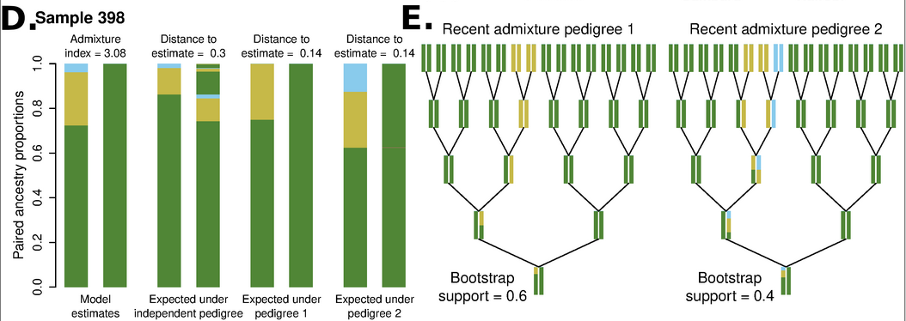

# apoh - **A**dmixture **P**edigrees **O**f **H**ybrids

apoh is a software to infer, explore, rank and visualize recent admxiture pedigrees of hybrids. As input it takes the estimates of paired ancestry proportions that can be produced by NGSremix -bothanc 1. From the estimates apoh allows to find admixture pedigrees more likely to explain the observed proporitons, visualize them, rank them, explore the fit both visually and through summary indices, etc.


# Usage

## NGSremix

As a first step before using apoh, it is necessary to estimate paired ancestry proportions for your data using [NGSremix](https://github.com/KHanghoj/NGSremix). NGSremix can be installed from github with:

```
git clone https://github.com/KHanghoj/NGSremix.git
cd src
make -f CPP_Makefile
```

NGSremix can then be run from either genotype data in [binary PLINK format](https://www.cog-genomics.org/plink/1.9/formats#bed) or genotype likelihood data in [beagle format](https://popgen.dk/angsd/index.php/Genotype_Likelihoods#Beagle_format) if you have low depth sequencing data. NGSremix will also need the ancestral population allele frequencies, that you can estimate with [ADMIXTURE](https://dalexander.github.io/admixture) or [NGSadmix](www.popgen.dk/software/index.php/NgsAdmix) for genotype or genotype likelihood data, respectively. Assuming we have K ancestral populaiton, ancestral population allele frequencies can be estiamted with:

### Allele frequency estimation with genotype data

```
# with genotype data
admixture <path to plink prefix> <K>
```
The ancestral population allele frequencies will be in the filed called in {plinkprefix}.K.P, which can be used directly as input to NGSremix with the `-fname` argument.

### Allele frequency estimation with genotype likelihood data

```
# with genotype likelihood data
#NGSadmix -likes <path to beagle file> _K <K> -outifles <output prefix>
```
The ancestral population allele frequencies will be in the filed called in {outrpefix}.fopt.gz, which can be used directly as input to NGSremix with the `-fname` argument.

### Estimation of paired ancestry proportions with NGSremix

Then you can use NGSremix to estimate paired ancestry proportions with:

```
# with genotype data
NGSremix -plink <path to plink prefix> -fname <path to population allele frequencies file>  -bothanc 1 -P <number of threads> -o <name of output file>

# with genotype likelihood data
NGSremix -beagle <path to beagle file> -fname <path to population allele frequencies file>  -bothanc 1 -P <number of threads> -o <name of output file>
```

This will produce a file called output.anccoeff (where output is the name speficied with the -o option in NGSremix). This file contains the parameter estimates for two models of paired ancestry proporitons, the 'parental admixture model' and the 'paired ancestries proporitons model', together with some information for each model and sample (log likelihood of the data and number of EM iterations needed for convergence). The ancestry estimates assume the chosen number of populations (K) and ancestral population allele frequencies are accurate. If they are not, or if the focal individuals have ancestry from populations not well represented in the dataset, the ancestry estiamtes and downstream pedigree inference will not be accurate.

## apoh

apoh is comprised of a set of R function to interpret the paired ancestry proportion estimates by NGSremix. It allows to visualize the paired ancestry proproitons estiamtes with NGSremix, find recent admxiture pedigrees that best explain them, test whether it is in fact a recent admixture pedigree what best explain, evaluate the fit, etc.

apoh can be run in three different ways: through the shiny app as a Graphical User Interface (GUI), using the commanline tool `apoh.R` or sourcing in R the `apohFuns.R` and directly interacting with them. Below are instructions for the different usages

### apoh Graphical User Interface (GUI)

The shiny app for apoh can be accessed online in:

`http://pontus.popgen.dk:3838/genis/apoh`

The GUI can also be run locally by running from an R terminal from the folder where apoh is downloaded `shiny::runApp('shiny')` (this usage has not been tested)

The GUI shiny app is the recommended way to use apoh, specially for exploratory usages. For producing good quality visulization it might be necessary to use command line tool or use directly the R functions.

### apoh command line

apoh can also be run as a command line Rscript, which will produce as output a folder with different plots and tables. The basic usage of the script is:

```
Rscript apoh.R --infile <path to .anccoeff file> --outdir <name of output directory>
```

You can see other optional arguments with:

```
Rscript apoh.R -h
```

The script will then create the specified output directory (if it already exists will stop with an error except if the `--forcedir TRUE` option is used), and within the directory will create the following output:

```
parentalAdmixture.png : plot of parental admixture proportions for each sample.
allSummaryIndices.tsv : table with summary indices for all samples
```

and for each sample will create a directory called {sampleid} (where sampleid is either the specified in --ids or the rownames from the .anccoeff file is --ids is not used). Each directory contains:

```
{sampleid}_orderedPairAnc.png: plots of ordered paired ancestries.
{sampleid}_unorderedPairAnc.png: plots of unordered paired ancestries.
pedigreex_sample_{sampleid}.png: plot of x pedigree for x in 1 to npedigrees (default 2).
```


### **apoh** sourcing the R functions

In construction


# Interpreting apoh's output


The basic idea behind apoh is that in the very first few generations after an admixture event, the descendants will have specific patterns of paired ancestry proportions in their genome, which deviate from the expected under an older admixture by showing an excess of interancestry heterozygosities. Using the paired ancestry proportions estiamted by NGSremix, **apoh** reconstructs recent admixture pedigrees that would result in similar proportions. Then we can use both visual inspection and measures of the distance between the model estimates and the expected proportions under a certain pedigree, to measure first is there is evidence for the individual being recently admixed, and second, in case there is, which is the most likely recent admiture pedigree. It is important to be aware in interpreting the output that the distance measures are not a formal statistical test but an heuristic ad hoc measure. We also add the option to perfomr block bootstrap on the estimates (IN DEVELOPMENT), that allows to then obtain the bootstrap support for each pedigree as a complementary measure of uncertainty. However it is important to consider that unless dathe data is mapped to a highly contiguous reference genome, the bootstrap estimates will miss the biological uncertainty associated with linkage disequilibirum and admixutre tracts.

We can use the example below from the manuscript as a guide to interpret apoh's output:



The left panels (D) shows, from left to right, the paired ancestry estiamted from the data, the ones expected under the 'independent pedigree' (which corresponds to an admixture pedigree where admxiture is not very recent), and the expected under the first and second 'most compatible' recent admxiutre pedigrees. How compatible an admixture pedigree is, is measured as the distance between the paired ancestries expected under the pedigree and the estiamted ones, shown above each proprotions. In this case we can see that the recent admxiture pedigrees have clearly a better fit than the independent peidgree, so we can be fairly sure that the individual is recently admixed. However both recent admxiutre pedigrees have very similar distances, despite being fundamentally different, indicating we cannot clearly distinguish between different recent admxiture scenarios. This is also shown with the bootstrap support, shown in the right panel for each pedigree, that highlight how both pedigrees are similarly supported across bootstrap replicates. 


# apoh citation

Garcia-Erill, G., Hanghøj, K., Heller, R., Wiuf, C., & Albrechtsen, A. (2023). Estimating admixture pedigrees of recent hybrids without a contiguous reference genome. Molecular Ecology Resources, 00, 1– 16. https://doi.org/10.1111/1755-0998.13830 
